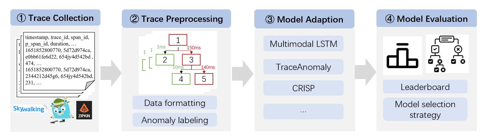
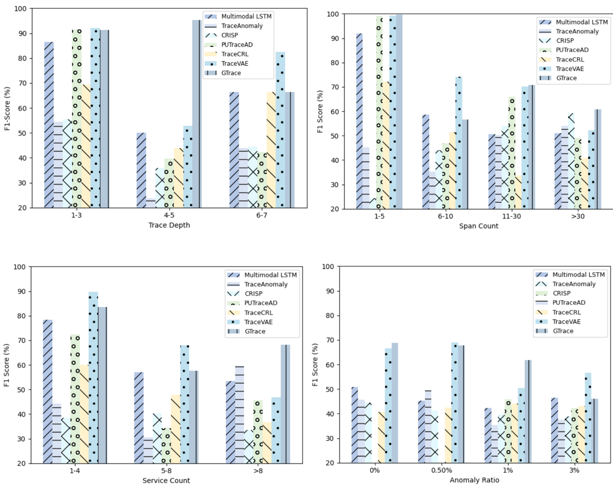
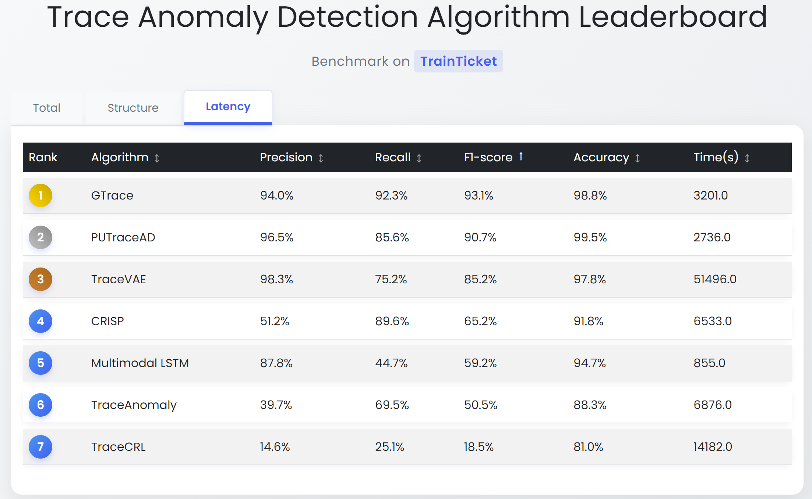

# <center>TADBench</center>

## 🧭 Overview

TADBench is a comprehensive  benchmark suite designed specifically for evaluating trace anomaly detection algorithms. It encompasses five trace datasets and integrates seven state-of-the-art anomaly detection methods. All datasets are labeled, and the algorithms are implemented under a unified SDK, ensuring consistency and ease of use. By standardizing both data formats and code implementations, TADBench enables researchers to perform rigorous and reproducible experiments, thereby gaining insights into each method's strengths and limitations. This practical guidance facilitates more informed algorithm selection for real-world deployments, effectively bridging the gap between academic research and industrial application.

## 🚀 Usage

### 🗂️ Dataset Standardization

To enable efficient algorithm evaluation and cross-dataset comparisons, we implement a unified data format for all trace datasets. New datasets can be easily integrated while maintaining compatibility with existing detection algorithms.

```python
@dataclass
class Span:
    """Represents a single operation in distributed tracing"""
    trace_id: str                   
    span_id: str                    
    parent_span_id: Optional[str]   
    children_span_list: List['Span'] 
    
    start_time: datetime            
    duration: float                 # Execution time in milliseconds
    service_name: str               
    anomaly: int = 0                # 0=normal, 1=abnormal
    status_code: Optional[str] = None 
    operation_name: Optional[str] = None 
    root_cause: Optional[bool] = None    # True if root cause span
    latency: Optional[int] = None        # 1=latency anomaly
    structure: Optional[int] = None      # 1=structural anomaly
    extra: Optional[dict] = None         

@dataclass 
class Trace:
    """Complete trace representation"""
    trace_id: str                   
    root_span: Span                 
    span_count: int = 0
    anomaly_type: Optional[int] = None   # 0=normal, 1=latency, 2=structure, 3=both
    source: Optional[str] = None    # Origin info
```

### 🧰 Algorithm SDK

This benchmark uses a standardized template (`TADTemplate`) to ensure consistent implementation and evaluation of trace anomaly detection algorithms. All algorithms inherit from this abstract base class, standardizing the format of inputs and outputs across different algorithms.

```python

class TADTemplate(ABC):
    def __init__(self, dataset_name=None, data_path=None):
        self.dataset_name = dataset_name
        self.data_path = data_path

    @abstractmethod
    def preprocess_data(self):
        """Preprocess raw trace data (feature engineering, normalization, etc.)"""
        pass

    @abstractmethod
    def train(self):
        """Train model and save trained model"""
        pass

    @abstractmethod
    def test(self):
        """Evaluate model by different datasets"""
        pass
 ```
 ### 🧪 Implementing New Algorithms   
Researchers can add new detection algorithms by:
1. Inheriting from TADTemplate
   
2. Implementing all abstract methods

3. Maintaining consistent input/output formats


## ⚙️ Installation


 ```python
def main(mode, dataset_name, data_path, anomaly_type):
    arg = TraceAnomaly(dataset_name=dataset_name, data_path=data_path)
    if mode == 'preprocess':
        arg.preprocess_data()
    elif mode == 'train':
        arg.train()
    elif mode == 'test':
        arg.test(anomaly_type=anomaly_type)
    else:
        print("Please choose specific mode from 'preprocess', 'train' and 'test'")
 ```

 Each algorithm implementation includes a `main.py` entry point with a unified interface. Depending on your task (preprocessing, training, or testing), you can execute different modes via command-line arguments.

If you want to preprocess data before training or testing, use the following command:

```bash
python main.py --mode preprocess --dataset_name <DATASET_NAME> --data_path <DATA_PATH>
```

- `<DATASET_NAME>`: Name of the dataset 
- `<DATA_PATH>`: Path to the raw dataset


To train an algorithm on a specific dataset, run:

```bash
python main.py --mode train --dataset_name <DATASET_NAME>
```

This will load the dataset, train the model, and save the checkpoints accordingly.

To evaluate the trained model on the dataset, execute:

```bash
python main.py --mode test --dataset_name <DATASET_NAME> --anomaly_type <ANOMALY_TYPE>
```

This will load the trained model and output evaluation results such as precision, recall, F1-score and accuracy.
## 💾 Datasets
All datasets are stored in ./Datasets. The following table summarizes different characteristics of the datasets.

| Dataset | Average Trace Depth | Average Span Numbers per Trace | Granularity | Service Scale | Average Service Number per Trace | Operation Scale | Average Operation Number per Trace |
|------------|---------------------|--------------------------------|-------------|--------------|----------------------------------|----------------|----------------------------------|
| TrainTicket | 3.3                 | 39.0                           | Operation   | 29           | 5.9                              | 64             | 7.6                              |
| GAIA       | 4.7                 | 9.3                            | Service   | 10           | 6.4                              | -              | -1                              |
| AIOps2020  | 5.5                 | 23.1                           | Service     | 10           | 7.8                              | -              | -                                |
| AIOps2022  | 4.2                 | 21.7                           | Operation   | 40           | 6.9                              | 29             | 11.6                             |
| AIOps2023  | 3.8                 | 14.5                           | Service     | 37           | 1.3                              | -              | -                                |

## 🧠 Algorithms
We use 7 trace anomaly detection algorithms for evaluation, and the following figure categorizes these algorithms.
| Algorithm | Publication | Paper Title | 
|-------------------|--------------------|---------------------|
| Multimodal LSTM | CLOUD'19 | S. Nedelkoski, J. Cardoso, and O. Kao, “Anomaly detection from system tracing data using multimodal deep learning,” in 2019 IEEE 12th International Conference on Cloud Computing (CLOUD), 2019, pp. 179–186. |
| TraceAnomaly | ISSRE'20 | P. Liu, H. Xu, Q. Ouyang, R. Jiao, Z. Chen, S. Zhang, J. Yang, L. Mo, J. Zeng, W. Xue, and D. Pei, “Unsupervised detection of microservice trace anomalies through service-level deep bayesian networks,” in 2020 IEEE 31st International Symposium on Software Reliability Engineerin (ISSRE), 2020, pp. 48–58. |
| CRISP | USENIX ATC'22 | Z. Zhang, M. K. Ramanathan, P. Raj, A. Parwal, T. Sherwood, and M. Chabbi, “CRISP: Critical path analysis of Large-Scale microservice architectures,” in 2022 USENIX Annual Technical Conference (USENIX ATC 22) Carlsbad, CA: USENIX Association, Jul. 2022, pp. 655–672. | 
| TraceCRL | ESEC/FSE'22 | C. Zhang, X. Peng, T. Zhou, C. Sha, Z. Yan, Y. Chen, and H. Yang, “Tracecrl: contrastive representation learning for microservice trace analysis,” in Proceedings of the 30th ACM Joint European Software Engineering Conference and Symposium on the Foundations of Software Engineering, ser. ESEC/FSE 2022. New York, NY, USA: Association for Computing Machinery, 2022, p. 1221–1232. |
| PUTraceAD | ISSRE'22 | K. Zhang, C. Zhang, X. Peng, and C. Sha, “Putracead: Trace anomaly detection with partial labels based on gnn and pu learning,” in 2022 IEEE 33rd International Symposium on Software Reliability Engineering (ISSRE), 2022, pp. 239–250. |
| TraceVAE | WWW'23 | Z. Xie, H. Xu, W. Chen, W. Li, H. Jiang, L. Su, H. Wang, and D. Pei, “Unsupervised anomaly detection on microservice traces through graph vae,” in Proceedings of the ACM Web Conference 2023, ser. WWW ’23. New York, NY, USA: Association for Computing Machinery, 2023, p. 2874–2884. |
| GTrace | ESEC/FSE'23 | Z. Xie, C. Pei, W. Li, H. Jiang, L. Su, J. Li, G. Xie, and D. Pei, “From point-wise to group-wise: A fast and accurate microservice trace anomaly detection approach,” in Proceedings of the 31st ACM Joint European Software Engineering Conference and Symposium on the Foundations of Software Engineering, ser. ESEC/FSE 2023. New York, NY, USA: Association for Computing Machinery, 2023, p. 1739–1749. |

## 📈 Results
We record the F1-score and Accuracy for each algorithm on each dataset in the following table.

| Algorithm         | TrainTicket F1 (%) | TrainTicket ACC (%) | GAIA F1 (%) | GAIA ACC (%) | AIOps2020 F1 (%) | AIOps2020 ACC (%) | AIOps2022 F1 (%) | AIOps2022 ACC (%) | AIOps2023 F1 (%) | AIOps2023 ACC (%) |
|-------------------|--------------------|---------------------|-------------|--------------|------------------|-------------------|------------------|-------------------|------------------|-------------------|
| Multimodal LSTM   | 68.5               | 73.7                | 89.8        | 70.7         | 54.5             | 41.6              | 59.2             | 51.4              | 64.4             | 80.5              |
| TraceAnomaly      | 62.6               | 82.1                | 46.3        | 65.3         | 56.8             | 77.9              | 58.5             | 78.7              | 55.4             | 82.9              |
| CRISP             | 62.5               | 82.0                | 44.5        | 64.1         | 57.0             | 78.0              | 58.1             | 78.5              | 66.4             | 87.2             |
| PUTraceAD         | 95.4               | 98.9                | 68.6        | 84.8         | 48.3             | 78.6              | 68.1             | 88.1              | **74.7**         | 95.5              |
| TraceCRL          | 55.6               | 50.9                | 75.0        | 73.9         | 53.0             | 40.8              | 53.2             | 36.2              | 44.2             | 57.4              |
| TraceVAE          | 97.3               | 98.2                | **90.9**    | 91.1         | 57.1             | 72.7              | **78.9**         | 86.7              | 74.0             | 90.0              |
| GTrace            | **99.4**           | 80.3                | 70.9        | 64.5         | **71.8**         | 81.9              | 76.5             | 93.8              | 70.3             | 87.6              |

We also compare the performance of different algorithms on datasets with varying data characteristics. The following figure summarize the results:

## 🏆 Algorithm Leaderboard
We implement an evaluation leaderboard to systematically compare detection performance across algorithms and datasets.

## 📚 References
